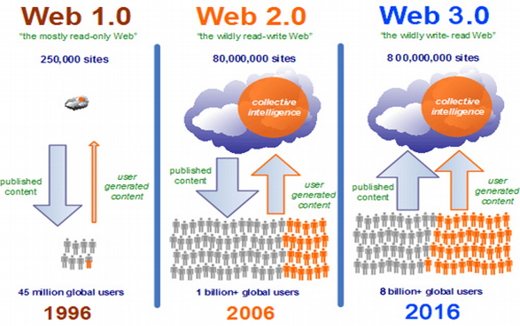
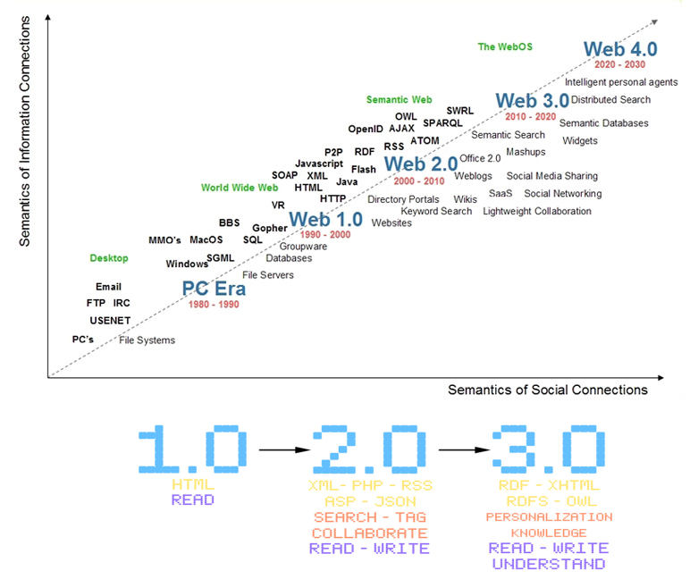

A good introduction to P2P is provided by the following two documents:

* Mirco Tribastone [I sistemi peer-to-peer](http://www.diit.unict.it/users/alombard/newweb/ava/ppt/p2p.pdf)
* Eng Keong Lua, J. Crowcroft,  M. Pias, R. Sharma, S. Lim. [A survey and comparison of peer-to-peer overlay network schemes](http://ieeexplore.ieee.org/document/1610546/) IEEE Communications Surveys & Tutorials ( Volume: 7, Issue: 2, Second Quarter 2005 )

There is no consensus on the evolution of the Web. For sure, the amount of content generated by users and IoT devices will grow.

Someone envision the realization of the so called Semantic Web 

More in line with the content of this material we embrace the following vision presented by [Jamie Burke](https://nextconf.eu/2016/09/next16-blockchain-will-build-web-3-0-says-jamie-burke/)

* Web 1.0 was the read-only web
* Web 2.0 was the mediated read-write web - the rise of the platforms that became trust brokers. But there were issues with security and privacy - and censorship.
* Web 3.0 is an unmediated reed-write web

Blockchain enables unmediated transactions, through the trustful nature of the blockchain. It's the read-write-own web. You can own and participate in owning the protocol. It's both peer to peer and machine to machine. And it's applicable to people, companies - and autonomous entities.

A good introduction to blockchain - even if focused on bitcoin - is [here](http://www.imponderablethings.com/2013/07/how-bitcoin-works-under-hood.html)