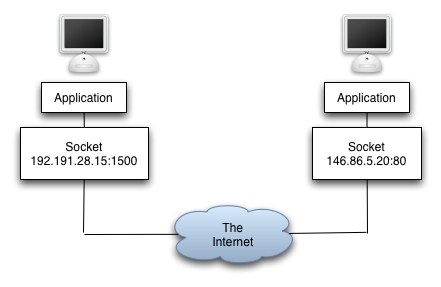
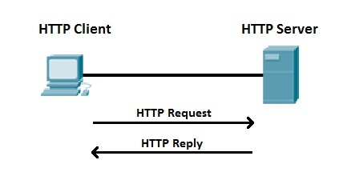

The purpose of this material is to provide a step-by-step overview of some of the main techniques employed in modern network application and services. The focus here is on the Application Layer of the [Internet Protocol Suite](https://en.wikipedia.org/wiki/Internet_protocol_suite), so we assume that the reader is familiar with the main concepts of the link, network and transport layers.

Notice that we do not want to re-invent the wheel, so whenever possible we will use material on the Internet and we'll try to promptly credit it. If we are missing some credit, please let us know.

## [Sockets](Socket-and-HTTP)

The first step to build a network application is the ability to establish a communication between two nodes. The endpoints of such communications are [sockets](Socket) and are used

> for sending or receiving data at a single node in a computer network [wikipedia](https://en.wikipedia.org/wiki/Network_socket).
<!--

--> 

Sockets allow us to send and receive data over TCP, while DatagramSockets are employed for UDP.

## [HTTP](Socket-and-HTTP)

Once we know how to send and receive data we need a protocol, namely a set of rules and conventions to structure the communication between the nodes. Indeed, it is not sufficient for the initiator to send the data, such data have to be understood by the responder. Similarly, the initiator needs to understand the possible answer provided by the responder. This is roughly the purpose of a protocol, namely the specification of the interactions between the communicating entities.  

Among the protocols at application layer, we will focus on [HTTP](HTTP), the main protocol for the World Wide Web. This is a classical example of a Client/Server. The Client initiate the communication requesting a service to the Server that reply granting/denying access to the requested service. In HTTP the requested service is usually related to the management of a resource identified by an [URL](https://en.wikipedia.org/wiki/URL). As an example, when you write http://www.gihub.com in your browser (i.e. the HTTP Client), you are requesting to GET the default web page (i.e. the resource) in the github server. 
<!--

--> 

## [Application Server](Application-Server)

Now that we now how to properly communicate with the HTTP protocol, we need a server capable to elaborate "complex" replies to HTTP requests, possibly interacting with local or remote resource. The tool in charge of elaborating such replies is the Application Server.

<!--
: [NodejS](https://nodejs.org/en/)
-->

## [REST](REST)

Putting together stuff on the Internet can be extremely complex. How to properly describe what a resource is and does? 

Representational state transfer (REST) or RESTful web services are a way of providing interoperability between computer systems on the Internet via HTTP. REST-compliant Web services allow requesting systems to access and manipulate textual representations of Web resources using a uniform and predefined set of stateless operations. 

<!--
: [Express](https://expressjs.com/)
-->

## [Authentication and Authorization](Authentication-and-Authorization)

REST is a convenient way to access resources over the Internet, but a fundamental question arises: who should be able to access? 

OAuth is an open standard for access delegation, commonly used as a way for Internet users to grant websites or applications access to their information on other websites but without giving them the passwords.

<!--
Oauth and Password
-->

## [Web Sockets](Web-Sockets)

The HTML5 WebSockets specification defines an API that enables web pages to use the WebSockets protocol for two-way communication with a remote host. It introduces the WebSocket interface and defines a full-duplex communication channel that operates through a single socket over the Web.

## [Messaging](Messaging)

HTTP is inherently synchronous: the client make a request and waits for the answer. In many cases, we need asynchronous communications, and this is exactly the purpose of AMQP. The Advanced Message Queuing Protocol (AMQP) is an open standard application layer protocol for message-oriented middleware.

<!--
AMQP
-->

## [Microservices](Microservices)

Essentially, microservice architecture is a method of developing software applications as a suite of independently deployable, small, modular services in which each service runs a unique process and communicates through a well-defined, lightweight mechanism to serve a business goal.

<!--
Seneca
-->

## [PaaS](PaaS)

In the past, networking service required the deployment of complex network infrastructure at home

Nowadays, the deployment of complex mash-up network services has been facilitated by the  Platform as a Service (PaaS) concept. PaaS is a category of cloud computing services that provides a platform allowing customers to develop, run, and manage applications without the complexity of building and maintaining the infrastructure typically associated with developing and launching an app.

<!--
Dokku
-->

## [IoT](IoT)

In the recent years, the miniaturization and reduction of HW costs (Moore's law) and the ability of supporting million or even billions of connected devices have pushed  the Internet of things (IoT). IoT is the network of physical devices, vehicles, home appliances, and other items embedded with electronics, software, sensors, actuators, and network connectivity which enable these objects to connect and exchange data. Each thing is uniquely identifiable through its embedded computing system but is able to inter-operate within the existing Internet infrastructure.

<!--
### Dealing with constraints: COAP and MQTT
-->

## [Data streaming](Streaming)

The IoT vision implies the generation of of an incredible amount of data (i.e. Big Data) characterized by  unprecedented volumes, variety and velocity. Contrary to messages, that have a well defined start and end, data streaming is a continuous flow of data that has to be managed on the fly.  

<!--
Kafka
-->

## [Beyond Client Server](Beyond-Client-Server)
<!-- P2P, Blockchain, Web 3.0, Tor -->
Up to now, we considered Client Server architecture. However, there are a number of other options. Peer-to-peer (P2P) computing or networking is a distributed application architecture that partitions tasks or workloads between peers. Peers are equally privileged, equipotent participants in the application. They are said to form a peer-to-peer network of nodes.
Peers make a portion of their resources, such as processing power, disk storage or network bandwidth, directly available to other network participants, without the need for central coordination by servers or stable hosts.[1] Peers are both suppliers and consumers of resources, in contrast to the traditional client-server model in which the consumption and supply of resources is divided.