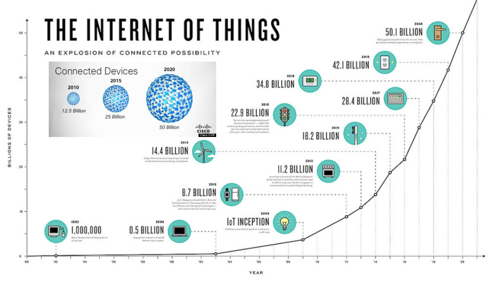

The following picture from [here](https://www.i-scoop.eu/internet-of-things-guide/) well depicts the IoT


 
There number of possible IoT applications is constantly growing and now covers a number of applications domains. 




The real value of the IoT comes from the connectivity


that allows things to deliver and share their sensed data to distill intelligence


[But why now](https://blog.networks.nokia.com/iot/2016/03/21/moores-law-metcalfes-law-iot/)


A reference model for the IoT is shown in the following picture


The value is on the data


A rich an heterogeneous ecosystem


IoT devices are resource constrained and require specific protocols that take into consideration such limits. Among the most relevant one there are: MQTT and COAP.

A good introduction to MQTT is [here](https://www.slideshare.net/paolopat/mqtt-iot-protocols-comparison) while COAP is [here](http://coap.technology/)


[Thingsboard](https://thingsboard.io/) is an open source IoT platform. It can be installed on docker following the  instruction available [here](https://thingsboard.io/docs/user-guide/install/docker/).

I like Thingsboard because is well designed and natively support mqtt and coap. 


You can use the reference examples [here](https://thingsboard.io/docs/getting-started-guides/helloworld/), where the address of the mqtt broker is mqtt://127.0.0.1:1883, while the one for coap is mqtt://127.0.0.1:5683

I recently made a class on IoT an used the following example with [mosquitto](https://mosquitto.org/) 

```
mosquitto_sub -h test.mosquitto.org -p 1883 -t 'outTopic' -v -d
mosquitto_pub -h test.mosquitto.org  -p 1883 -t 'outTopic' -m 0 -d
```

If you have a [nodemcu](http://www.nodemcu.com/index_en.html) device, you can upload the [mqtt_ESP8266.ino](https://github.com/knolleary/pubsubclient/blob/master/examples/mqtt_esp8266/mqtt_esp8266.ino) from the examples in the arduino ide and simply focus your attention to the following few code blocks

```c
const char* ssid = "...";
const char* password = "...";
const char* mqtt_server = "test.mosquitto.org";
```

```c
randNumber = random(100);
snprintf (msg, 75, "%ld", randNumber);
client.publish("outTopic", msg);
client.subscribe("inTopic");
```

If you want to interact with your mobile phone, a simple option is to use [mqtt dash](https://play.google.com/store/apps/details?id=net.routix.mqttdash)

Where, in the value gauge put outTopic as Topic, in the button put inTopic as Topic and 

OnReceive
```
if (!event.data){
	event.data=true;
} else if {
	event.data=true;
} else {
	event.data=false;
}
```

OnDisplay
```
if (event.data){
	event.on=true;
} else {
	event.on=false;
}
```

OnTap
```
if (event.data){
	app.publish('inTopic',1,false,0);
} else {
	app.publish('inTopic',0,false,0);
}
```


