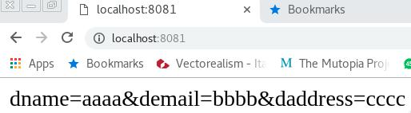

All you need to know on sockets and communication can be found in the Java Tutorial on 
[What Is a Socket?](https://docs.oracle.com/javase/tutorial/networking/sockets/definition.html)

In a sentence: 

> A socket is one endpoint of a two-way communication link between two programs running on the network. A socket is bound to a port number so that the TCP layer can identify the application that data is destined to be sent to. An endpoint is a combination of an IP address and a port number. Every TCP connection can be uniquely identified by its two endpoints. That way you can have multiple connections between your host and the server.

We explore sockets implementing the HTTP protocol using the JAVA language. 

As already observed, a protocol is a controlled sequence of messages that is exchanged between two or more systems to accomplish a given task. 

Protocol specifications define this sequence together with the format or layout of the messages that are exchanged

In HTTP a client makes a request, characterized by a method, as depicted in the following figures.


The server responds to the request specifying the nature of the response with a status code.

 


### Experiments

As a Web server we use [NGINX](https://www.nginx.com/resources/wiki/), a free, open-source, high-performance HTTP server.

In most of the experiments, we will setup a convenient experimental environment employing [docker](https://www.docker.com/) see [[Tools]] for further details

[NGINX sul Docker Hub](https://hub.docker.com/_/nginx/)

`docker run --name ngix4RC -d nginx`

`docker ps`  lists all the running images
 
The code for this part is available [here](https://github.com/andreavitaletti/RC/tree/master/Socket%20and%20HTTP)

Note that the service is running but cannot be accessed from the host. The following script allows us to map the folder in the host machine 
`/home/andrea/Documents/University/...` into the folder in the container `/usr/share/nginx/html` and to **map** the port 80 in the container to the port 8080 of the host.

```
docker run --name ngix4RC -p 8080:80  
-v '/home/andrea/Documents/University/Didattica/RC2018/docker/1. Simple Web Server/some/content':/usr/share/nginx/html:ro
-d nginx
```

Now if put in your browser the localhost:8080 you can finally access the content in `/usr/share/nginx/html`. 


If you need a shell to open a shell in the container, get the container id by `docker ps`  and then 

`sudo docker exec -i -t <container_id> /bin/bash`

Finally, it can be convenient to build new images automatically by reading the instructions from a Dockerfile

`docker build -t some-content-nginx .`

Then you can run the corresponding container by

`docker run --name some-nginx -d -p 8080:80 some-content-nginx`

It is now time to inspect the underlying HTTP flow. To this purpose we will use the protocol analyser  [Wireshark](https://www.wireshark.org/). Remember to filter only http traffic and enjoy. 


This tool allows you to inspect at all levels the interaction between the client and the server. Up to know we used "commercial" software, now we aim at implementing our PoC (Proof-of-Concept)of the client and the server. Please note that even if those are only PoC they can effectively interact with "commercial" softwares. Why? Simple, they correctly implement a minimal set of HTTP commands.

### Our HTTP-client PoC (i.e. a browser) ... it works with NGINX

```java
import java.io.*;
import java.net.*;

public class SocketSimpleWebBrowser {
    public static void main(String[] args) 
    	throws IOException {

        Socket echoSocket = null;
        PrintWriter out = null;
        BufferedReader in = null;
        
     
        try {
            echoSocket = new Socket("localhost", 8080);
            out = new PrintWriter(
            	echoSocket.getOutputStream(), true);
            in = new BufferedReader(
            	new InputStreamReader(
                echoSocket.getInputStream()));
        } catch (UnknownHostException e) {
            System.err.println("Don't know about the host");
            System.exit(1);
        } catch (IOException e) {
            System.err.println("Couldn't get I/O for this connection.");
            System.exit(1);
        }

		out.println("GET /index.html HTTP/1.1\r");
		out.println("Host: localhost\r");
		out.println("User-Agent: Mozilla/5.0 (Linux; Android 6.0; Nexus 5 Build/MRA58N) AppleWebKit/537.36 (KHTML, like Gecko) Chrome/59.0.3071.115 Mobile Safari/537.36\r");
		out.println("\r");


		String data;

		while ((data = in.readLine()) != null) {
			System.out.println(data);
		}
	

		out.close();
		in.close();
		echoSocket.close();
    }
}
```
### Our HTTP-server PoC (i.e. a web server) ... it works with Chrome

With a little effort let's make it multi thread... 

```java
import java.net.*;
import java.io.*;

public class SimpleWebServer {
    public static void main(String[] args) throws IOException {

        ServerSocket serverSocket = null;
        try {
            serverSocket = new ServerSocket(4444);
        } catch (IOException e) {
            System.err.println("Could not listen on port: 4444.");
            System.exit(1);
        }

        Socket clientSocket = null;
        try {
            clientSocket = serverSocket.accept();
        } catch (IOException e) {
            System.err.println("Accept failed.");
            System.exit(1);
        }

        PrintWriter out = new PrintWriter(clientSocket.getOutputStream(), true);
        BufferedReader in = new BufferedReader(
				new InputStreamReader(
				clientSocket.getInputStream()));
        String inputLine;
        

        while ((inputLine = in.readLine()) != null) {
			// https://stackoverflow.com/questions/4758525/carriage-return-and-new-line-with-java-and-readline
			if (inputLine.length() == 0) break;  
				System.out.println(inputLine);                
        }
        
        String message = new String(args[0]);
        
        out.println("HTTP/1.1 200 ok\r\n");
        out.println("<html> \r\n");
        out.println("<head> \r\n");
        out.println("<title> index </title>\r\n");
        out.println("</head> \r\n");
        out.println("<body> \r\n");
        out.println("<p><b>"+message+"</b></p> \r\n");
        out.println("</body> \r\n");
        out.println("</html> \r\n");

        
        out.close();
        in.close();
        clientSocket.close();
        serverSocket.close();
    }
}

```
### Handling the POST

In order to handle a POST in an interesting scenario we need an application server [[Application-Server]]

>Docker creates isolated machine (container). Each container contains only one process (Apache or Mysql or another); And Dockerfile defines how to build a image.
>Docker compose allows run, links and configure the bunch of containers together. 
[ref](http://v0cdocker.blogspot.com/2017/11/docker-compose-vs-dockerfile.html)

We will use the following docker.compose.yml

```
version: "2"
services:
  node1:
    image: "node:8"
    user: "node"
    working_dir: /home/node/app
    environment:
      - NODE_ENV=production
    volumes:
      - /home/andrea/Documents/University/Didattica/RC2018/docker/2.Node:/home/node/app
    ports:
      - "8081:8081"
    expose:
      - 8081
    command: "npm start"
  node2:
    image: "node:8"
    user: "node"
    working_dir: /home/node/app
    environment:
      - NODE_ENV=production
    volumes:
      - /home/andrea/Documents/University/Didattica/RC2018/docker/2.Node:/home/node/app
    ports:
      - "8082:8081"
    expose:
      - 8081
    command: "npm start"
```

To run the container simply digit `docker-compose up`

and you will run the following server on port 8081 and 8082 of localhost both mapped into port 8081 on the containers.

```javascript
var http = require('http');
var fs = require('fs');

var server = http.createServer(function (req, res) {

    if (req.method === "GET") {
        res.writeHead(200, { "Content-Type": "text/html" });
        fs.createReadStream("form.html", "UTF-8").pipe(res);
    } else if (req.method === "POST") {
    
        var body = "";
        req.on("data", function (chunk) {
            body += chunk;
        });

        req.on("end", function(){
            res.writeHead(200, { "Content-Type": "text/html" });
            res.end(body);
        });
    }

}).listen(8081);
```

As you can image the else statement manages POST requests. Now you can access the app at localhost:8081 and you first go to the GET 


the one you fill-up the form and submit you go to the POST that is econded in the form.html

```html
<!DOCTYPE html>
<html lang="en">
<head>
    <meta charset="UTF-8">
    <meta name="viewport" content="width=device-width, initial-scale=1.0">
    <meta http-equiv="X-UA-Compatible" content="ie=edge">
    <title>Document</title>
</head>
<body>
    <form action="/" method="POST">
        <label>Name: </label>
        <input type="text" name="dname" value="" /><br />
        <label>Email: </label>
        <input type="text" name="demail" value="" /><br />
        <label>Address: </label>
        <input type="text" name="daddress" value="" /><br />
        <button>submit</button>
    </form>
</body>
</html>

```
and you get the following result 



As usual you can inspect the whole flow with wireshark.


